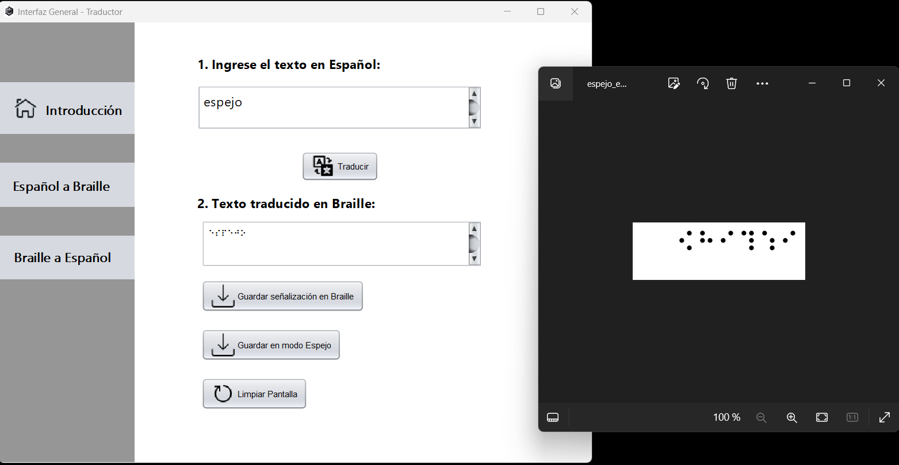

## Ejecución de casos de pruebas  
  
## Caso de prueba 1: Traducción de texto de español a Braille

  
  
  
  
## Caso de prueba 3 : Traducción de Braille a español

### Defectos encontrados
*Se encontró un defecto al automatizar las opciones de caracteres con botones especificos (mayusculas, simbolos , numeros) se permite ingresar estos caracteres de manera indefinida*
  
## Caso de prueba 4 : Traducción de textos con espacios en blanco y combinacion de mayusculas y minisculas

  

*A pesar de existir espacion en blanco al incio del texto y de igual forma entre las palabras , se puede observar que en la traduccion esto es controlado de manera correcta*
  
## Caso de prueba 5: Transcripción con vocales acentuadas  !

## Caso de prueba 6: Transcripción de números a Braille

## Caso de prueba 7: Generación de la señalética de español a braille

 

 

### Defecto encontrados
  
*No es posible guardar la imagen con un nombre especifico para luego realizar una mejor búsqueda de este.*
  
*La señalizacion es guardada aun cuando no hay nungun texto traducido , es decir se guarda una imagen en blanco*

## Caso de prueba 8: Generación de la traducción en formato espejo  
  
  

### Defecto Encontrados

*Al igual que la generación de la señalización no es posible establecer un nombre.  
No es posible generar más de una vez la imagen con la traducción de español a braille en modo espejo*

