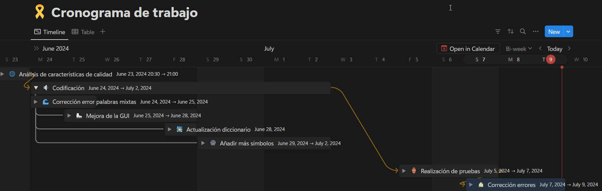

# ISWD652- CALIDAD DE SOFTWARE

# TEMA: Proyecto de Calidad de Software

# Planificación de Actividades
## Objetivos
- Definir los objetivos específicos del proyecto.
- Establecer un cronograma detallado.

## Cronograma

*Enlace cronograma*: https://tasteful-cycle-2dc.notion.site/ea7b5bdacd754e6ea18c9b41f8bfc91d?v=882cb3aa4c214ceb9071cd220ba41921*

## Actividades

### 1. Análisis características de calidad
**Fecha:** 23/06/2024  
**Duración:** 1 hora  

**Descripción:**
- Reconocimiento de características y subcaracterísticas aplicables al contexto de la aplicación software desarrollada.
- Identificación de aspectos a mejorar en el producto software

### 2. Codificación
**Fecha:** 24/06/2024  -  02/07/2024
**Duración:** 9 días

**Descripción:**
- Desarrollo de features que garanticen el cumplimiento de las características de calidad del producto y de uso.

### 3. Realización de pruebas
**Fecha:** 05/07/2024 - 07/07/2024  
**Duración:** 2 días

**Descripción:**
- Realización de la documentación de nuevos casos de pruebas.
- Ejecución de casos de pruebas.
- Identificación de errores presentados en la nueva versión del código.

### 4. Corrección de errores
**Fecha:** 07/07/2024 - 09/07/2024  
**Duración:** 3 días  

**Descripción:**
- Codificación realizada para asegurar que los errores encontrados sean corregidos debidamente.